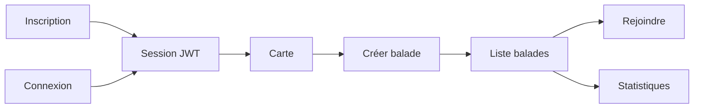

# 02 — Product Scope (MoSCoW)

## MUST (MVP — obligatoire)

| Fonctionnalité | Description | Statut |
|----------------|-------------|--------|
| **Inscription** | `/register` → compte + connexion auto | Fait |
| **Connexion / déconnexion** | `/login`, cookie JWT, `/api/auth/logout` | Fait |
| Carte stations | Leaflet + `GET /api/stations` (public) | Fait |
| Lister balades | `GET /api/ride-groups` (public) | Fait |
| Créer une balade | `POST /api/ride-groups` (JWT) | Fait |
| Rejoindre | `POST /api/ride-groups/[id]/join` (JWT) | Fait |
| Stats personnelles | `GET /api/stats` (JWT) | Fait |
| BDD + seed | ~500 stations + compte démo | Fait |
| Docker + CI | Compose + job CI **Docker** (build, smoke API) | Fait |

## SHOULD (post-MVP proche)

- Modifier / annuler sa balade (créateur)
- Migrations Prisma versionnées (`migrate` vs `db push` seul)
- Tests d'intégration API auth + ride-groups
- Rate limiting sur login

## COULD (plus tard)

- OAuth (Google), refresh token
- Routing OSM (OSRM)
- Notifications email / push
- Filtre par quartier, export iCal
- Rôle admin / modération

## WON'T (exclu)

| Exclusion | Raison |
|-----------|--------|
| Paiement Vélib' | Hors produit |
| App mobile native | Web responsive suffit |
| Chat intégré | Outils externes |
| Multi-villes | OpenData Paris uniquement |
| RBAC admin en BDD | Pas de table `Role` au MVP |

## Parcours utilisateur (avec auth)

## Compte démo (seed)

| Champ | Valeur |
|-------|--------|
| Email | `demo@example.com` |
| Mot de passe | `demo1234` |
| Pseudo | `demo` |

## Jalons

| Date | Jalon |
|------|-------|
| J-3 | Kickoff Pack + checkpoint |
| 22/05 | MVP + repo GitHub |
