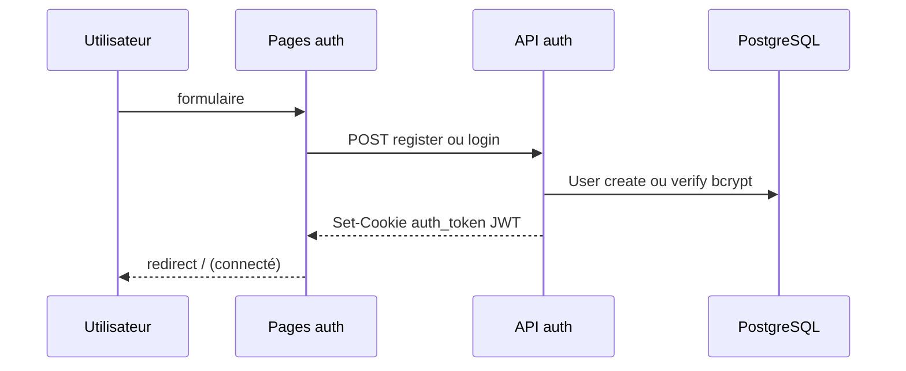
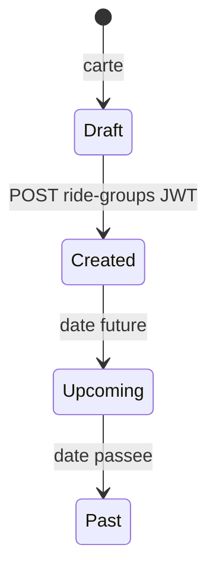
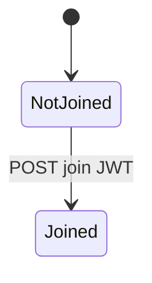

# 03 — Domain Model

## Entités métier

| Entité | Description |
|--------|-------------|
| **User** | Compte (pseudo, email, `passwordHash` bcrypt) |
| **Station** | Borne Vélib' (id OpenData, lat/lng) |
| **RideGroup** | Balade (titre, horaire, créateur, trajet) |
| **Participation** | Inscription User ↔ RideGroup |

## RBAC

| Rôle | Droits |
|------|--------|
| **Visiteur** | Carte, liste balades (`GET` public) |
| **Membre** (JWT) | Créer balade, rejoindre, stats perso |
| **Créateur** | `creatorId` = id du token |
| **Admin** | Non implémenté |

Auth : [ADR-004](./06-adr/ADR-004-jwt-auth.md) — cookie `auth_token`, pas de table `Role`.

## Règles métier (BR)

| ID | Règle | Implémentation |
|----|-------|----------------|
| BR-01 | Titre et date obligatoires | `createRideGroupSchema` |
| BR-02 | Stations existantes | FK Prisma |
| BR-03 | Pas de double inscription | PK `(userId, rideGroupId)` |
| BR-04 | À venir / passée | `departureTime` vs `now` |
| BR-05 | Métriques si départ + arrivée | `computeRideMetrics` |
| BR-06 | Haversine × 1,25 ; 30 kcal/km | `rideMetrics.ts` |
| BR-07 | Create / join / stats → connecté | middleware + `requireAuth` |
| BR-08 | Pas de `userId` / `creatorId` client | ID depuis JWT |
| BR-09 | Email / pseudo uniques | vérif avant `create` + UNIQUE BDD |
| BR-10 | `passwordHash` jamais exposé | `select` partiel sur User |

## Flux inscription / connexion

## Machines à états — Balade

## Machines à états — Participation

## API

### Auth

| Méthode | Route |
|---------|-------|
| POST | `/api/auth/register` |
| POST | `/api/auth/login` |
| POST | `/api/auth/logout` |
| GET | `/api/auth/me` |

### Métier

| Méthode | Route | Auth |
|---------|-------|------|
| GET | `/api/stations` | — |
| GET | `/api/ride-groups` | — |
| POST | `/api/ride-groups` | JWT |
| POST | `/api/ride-groups/[id]/join` | JWT |
| GET | `/api/stats` | JWT |

## Glossaire

| Terme | Définition |
|-------|------------|
| JWT | Token signé HS256, stocké en cookie httpOnly |
| RideGroup | Balade organisée |
| Participation | Lien d’inscription à une balade |
