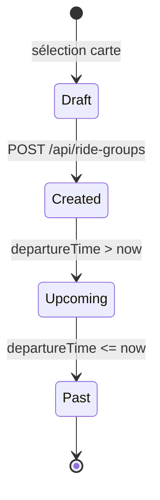
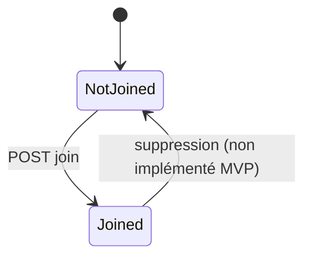

# 03 — Domain Model

## Entités métier

| Entité | Description |
|--------|-------------|
| **User** | Utilisateur de l'app (MVP : id=1 démo) |
| **Station** | Point Velib' (id = code OpenData, lat/lng) |
| **RideGroup** | Balade organisée (titre, horaire, créateur, trajet) |
| **Participation** | Lien User ↔ RideGroup (inscription) |

## RBAC (MVP vs cible)

| Rôle | MVP | Cible V2 |
|------|-----|----------|
| Visiteur | Non (user fixe) | Lecture carte publique |
| Membre | Créer / rejoindre / voir stats (user 1) | CRUD ses participations |
| Créateur | Idem membre + `creatorId` sur balade | Modifier / annuler sa balade |
| Admin | — | Modération stations / users |

**MVP :** pas de table `Role` ; `CURRENT_USER_ID = 1` dans `app/page.tsx` et `app/rides/page.tsx`.

## Règles métier (BR)

| ID | Règle | Implémentation |
|----|-------|----------------|
| BR-01 | Titre et date de départ obligatoires | Zod `createRideGroupSchema` |
| BR-02 | Stations départ et arrivée doivent exister | FK Prisma + validation IDs positifs |
| BR-03 | Un user ne peut pas s'inscrire deux fois à la même balade | PK composite `(userId, rideGroupId)` |
| BR-04 | Balade **à venir** si `departureTime > now`, sinon **passée** | Logique UI `/rides` |
| BR-05 | Distance / kcal affichées seulement si départ **et** arrivée | `computeRideMetrics` retourne `null` sinon |
| BR-06 | Distance = Haversine × 1,25 ; kcal = 30 × km | `src/lib/rideMetrics.ts` |
| BR-07 | Créateur auto-upsert si absent (démo) | `rideGroupService.createRideGroup` |

## Machine à états — Balade (logique)

Pas de colonne `status` en base : dérivé de `departureTime`.

| État | Condition |
|------|-----------|
| Draft | Stations sélectionnées, formulaire non envoyé |
| Created / Upcoming | Enregistrée, date future |
| Past | Date passée |

## Machine à états — Participation

## API métier (ressources)

| Méthode | Route | Action |
|---------|-------|--------|
| GET | `/api/stations` | Liste stations |
| GET/POST | `/api/ride-groups` | Lister / créer balades |
| POST | `/api/ride-groups/[id]/join` | S'inscrire |
| GET | `/api/stats?userId=1` | Stats agrégées |

## Glossaire

| Terme | Définition |
|-------|------------|
| Balade / RideGroup | Événement cycliste planifié |
| Station | Borne Vélib' Paris |
| Participation | Inscription d'un user à une balade |
