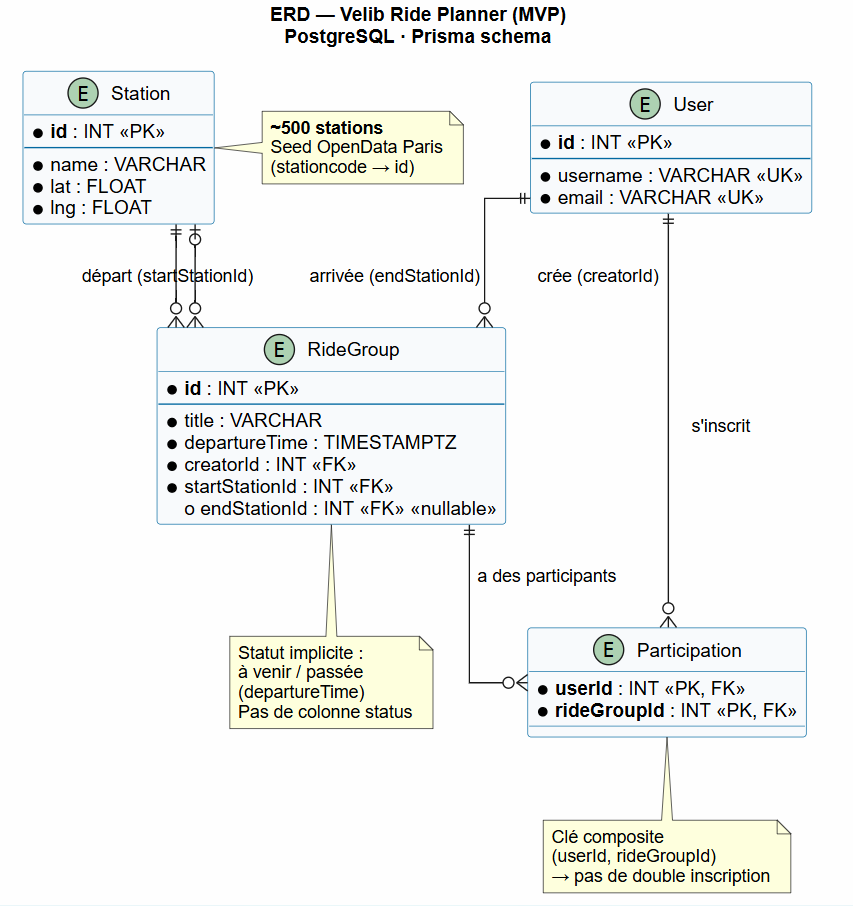
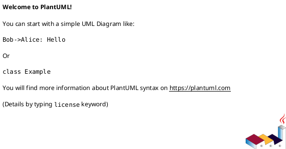

# 04 — Base de données

## 1. Choix moteur

| Critère | Choix |
|---------|-------|
| SGBD | **PostgreSQL 16** |
| ORM | **Prisma** (`@prisma/client`) |
| Justification | Relations FK (User, Station, RideGroup, Participation), intégrité, écosystème Next.js |

Voir [ADR-001](./06-adr/ADR-001-postgresql-prisma.md).

## 2. ERD

Diagramme logique aligné sur [`prisma/schema.prisma`](../../prisma/schema.prisma).

### Image

Source éditable : [`images/erd.puml`](./images/erd.puml) — régénérer sur [plantuml.com](https://www.plantuml.com/plantuml/uml/) ou via Kroki si le PNG est mis à jour.

### Source PlantUML

Fichier versionné : [`images/erd.puml`](./images/erd.puml)

### Relations (résumé)

| Relation | Cardinalité | FK |
|----------|-------------|-----|
| User → RideGroup (créateur) | 1 — N | `RideGroup.creatorId` |
| Station → RideGroup (départ) | 1 — N | `RideGroup.startStationId` |
| Station → RideGroup (arrivée) | 1 — 0..N | `RideGroup.endStationId` (nullable) |
| User ↔ RideGroup (participation) | N — N | table `Participation` |

## 3. Dictionnaire de données

### User

| Colonne | Type SQL | Contraintes | Description |
|---------|----------|-------------|-------------|
| id | SERIAL | PK | Identifiant |
| username | VARCHAR | UNIQUE, NOT NULL | Pseudo |
| email | VARCHAR | UNIQUE, NOT NULL | Email |

### Station

| Colonne | Type SQL | Contraintes | Description |
|---------|----------|-------------|-------------|
| id | INTEGER | PK | Code station OpenData (`stationcode`) |
| name | VARCHAR | NOT NULL | Nom affiché |
| lat | DOUBLE PRECISION | NOT NULL | Latitude WGS84 |
| lng | DOUBLE PRECISION | NOT NULL | Longitude WGS84 |

### RideGroup

| Colonne | Type SQL | Contraintes | Description |
|---------|----------|-------------|-------------|
| id | SERIAL | PK | Identifiant balade |
| title | VARCHAR | NOT NULL | Titre |
| departureTime | TIMESTAMPTZ | NOT NULL | Date/heure départ |
| creatorId | INTEGER | FK → User.id | Créateur |
| startStationId | INTEGER | FK → Station.id | Station départ |
| endStationId | INTEGER | FK → Station.id, NULL | Station arrivée (optionnel) |

### Participation

| Colonne | Type SQL | Contraintes | Description |
|---------|----------|-------------|-------------|
| userId | INTEGER | PK, FK → User.id | Participant |
| rideGroupId | INTEGER | PK, FK → RideGroup.id | Balade |

## 4. Index et intégrité

| Type | Détail |
|------|--------|
| PK | `User.id`, `Station.id`, `RideGroup.id`, `Participation(userId, rideGroupId)` |
| UNIQUE | `User.username`, `User.email` |
| FK | Toutes les relations Prisma ci-dessus |
| Index explicites MVP | Via contraintes UNIQUE Prisma uniquement |

## 5. Anti-patterns évités

- Pas de champ `tags` en CSV sur `RideGroup`
- Pas de duplication des coordonnées station dans `RideGroup` (normalisation via FK)
- Pas de table « fourre-tout » événements génériques

## 6. Dette schéma (voir registre 07)

- Pas de `created_at` / `updated_at`
- Pas de soft delete (`deleted_at`)
- Pas de colonne `status` (dérivé de `departureTime`)
- Synchronisation schéma via `prisma db push` (pas d'historique migrations prod)

## 7. Seed

- Script : `prisma/seed.cjs`
- Stations : API OpenData Paris (~500 enregistrements)
- User démo : `id = 1`, username/email générés si création via API
