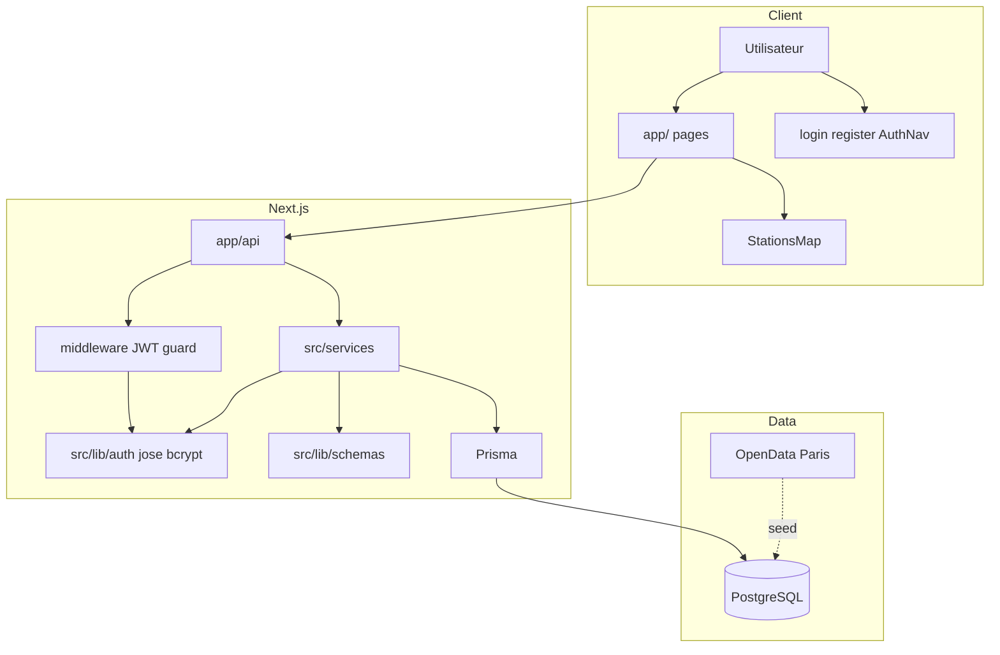

# 05 — Architecture

## Vue d'ensemble

Monorepo **Next.js 16** : UI React, API REST, auth JWT, services métier, Prisma, PostgreSQL.

## Schéma de composants



## Couches

| Couche | Dossier | Rôle |
|--------|---------|------|
| UI | `app/`, `src/components/` | Carte, balades, `AuthProvider`, `AuthNav` |
| Auth UI | `app/login/`, `app/register/` | Formulaires |
| API | `app/api/**/route.ts` | HTTP + codes erreur |
| Auth | `src/lib/auth/`, `src/services/authService.ts` | JWT, cookies, bcrypt |
| Validation | `src/lib/schemas/` | Zod (`auth`, `rideGroup`) |
| Métier | `src/services/` | `rideGroup`, `stats`, `auth` |
| Données | `prisma/`, `src/lib/prisma.ts` | Modèle + client |

## Routes API

| Route | Auth | Service |
|-------|------|---------|
| `POST /api/auth/register` | — | `authService.registerUser` |
| `POST /api/auth/login` | — | `authService.authenticateUser` |
| `POST /api/auth/logout` | — | clear cookie |
| `GET /api/auth/me` | optionnel | session courante |
| `GET /api/stations` | public | Prisma |
| `GET /api/ride-groups` | public | `listRideGroups` |
| `POST /api/ride-groups` | **JWT** | `createRideGroup` + `creatorId` token |
| `POST /api/ride-groups/[id]/join` | **JWT** | `joinRideGroup` + `userId` token |
| `GET /api/stats` | **JWT** | `getUserStats` |

## Patterns

| Pattern | Fichiers |
|---------|----------|
| Service layer | `src/services/*` |
| DTO enrichi | `withRideMetrics` |
| Validation Zod | `src/lib/schemas/*` |
| Erreurs API | `apiErrors.ts` (dont schéma BDD obsolète) |
| Auth middleware | `middleware.ts` + `requireAuth` |
| Cookie JWT httpOnly | `src/lib/auth/cookies.ts` |

## Variables d'environnement

| Variable | Usage |
|----------|--------|
| `DATABASE_URL` | Prisma / PostgreSQL |
| `JWT_SECRET` | Signature JWT (min. 16 car.) |

## Déploiement

```mermaid
flowchart LR
  DC[docker compose] --> APP[:3001]
  DC --> DB[(PostgreSQL)]
  GHA[GitHub Actions] --> lint test build
```

Entrypoint : `prisma generate` → `db push` → `seed` → `next start`.

## ADR

- [ADR-001](./06-adr/ADR-001-postgresql-prisma.md)
- [ADR-002](./06-adr/ADR-002-next-app-router.md)
- [ADR-003](./06-adr/ADR-003-mvp-sans-auth.md) — historique
- [ADR-004](./06-adr/ADR-004-jwt-auth.md) — **actif**

## Évolutions

- Refresh token, OAuth
- Migrations Prisma CI/CD
- Tests API auth + E2E
