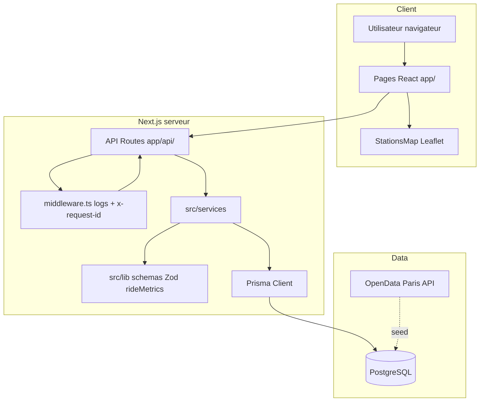
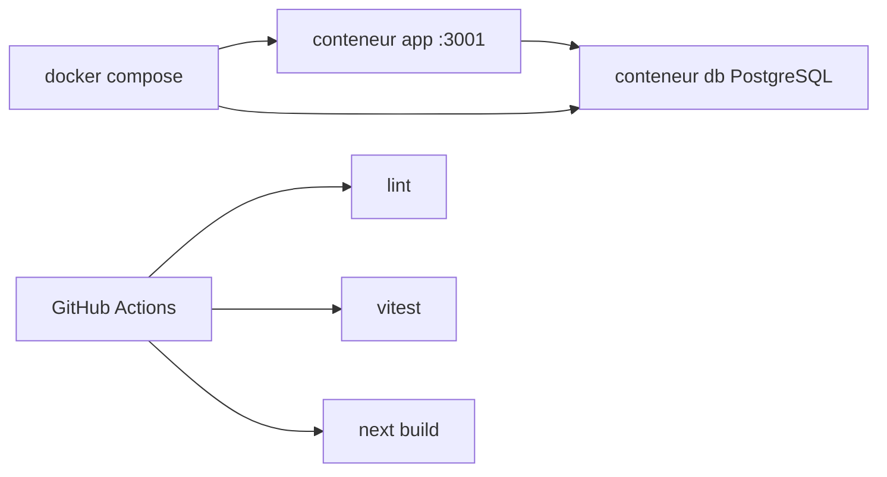

# 05 — Architecture

## Vue d'ensemble

Application **full-stack monorepo** Next.js : UI React (App Router) + API REST interne + couche services + Prisma + PostgreSQL.

## Schéma de composants

## Couches et responsabilités

| Couche | Dossier | Rôle |
|--------|---------|------|
| Présentation | `app/`, `src/components/` | Pages, carte, formulaires |
| API | `app/api/**/route.ts` | HTTP, parsing, codes erreur |
| Validation | `src/lib/schemas/` | Zod (entrées API) |
| Métier | `src/services/` | `rideGroupService`, `statsService` |
| Calculs | `src/lib/rideMetrics.ts`, `enrichRide.ts` | Distance, kcal, enrichissement DTO |
| Accès données | `src/lib/prisma.ts` | Singleton Prisma |
| Persistance | `prisma/schema.prisma` | Modèle relationnel |

## Routes API

| Route | Service / lib |
|-------|----------------|
| `GET /api/stations` | Prisma direct |
| `GET/POST /api/ride-groups` | `rideGroupService` |
| `POST /api/ride-groups/[id]/join` | `rideGroupService.joinRideGroup` |
| `GET /api/stats` | `statsService` |

## Patterns utilisés

| Pattern | Usage |
|---------|--------|
| **Service layer** | Logique hors des `route.ts` |
| **DTO / enrichissement** | `withRideMetrics` sur les balades |
| **Validation déclarative** | Zod dans `src/lib/schemas` |
| **Erreurs API centralisées** | `src/lib/apiErrors.ts` |
| **Middleware transversal** | Logs + `x-request-id` |

## Déploiement (MVP)

- Image : `Dockerfile` + `scripts/docker-entrypoint.sh` (`prisma generate`, `db push`, seed, `npm start`)
- Port hôte : **3001** → 3000 (évite conflit avec `npm run dev`)

## Décisions liées

- [ADR-001](./06-adr/ADR-001-postgresql-prisma.md) — PostgreSQL + Prisma
- [ADR-002](./06-adr/ADR-002-next-app-router.md) — App Router
- [ADR-003](./06-adr/ADR-003-mvp-sans-auth.md) — Pas d'auth au MVP

## Évolutions prévues

- Auth middleware + session/JWT
- Couche repository si tests d'intégration BDD multipliés
- Migrations Prisma en pipeline CI/CD prod
